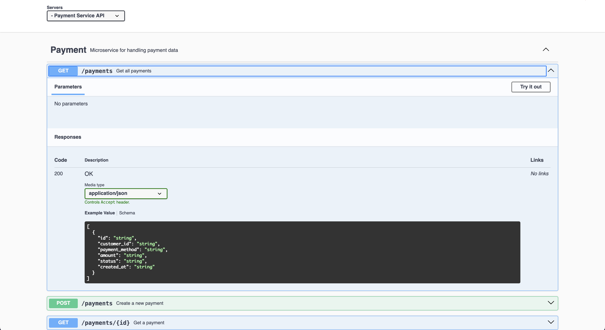
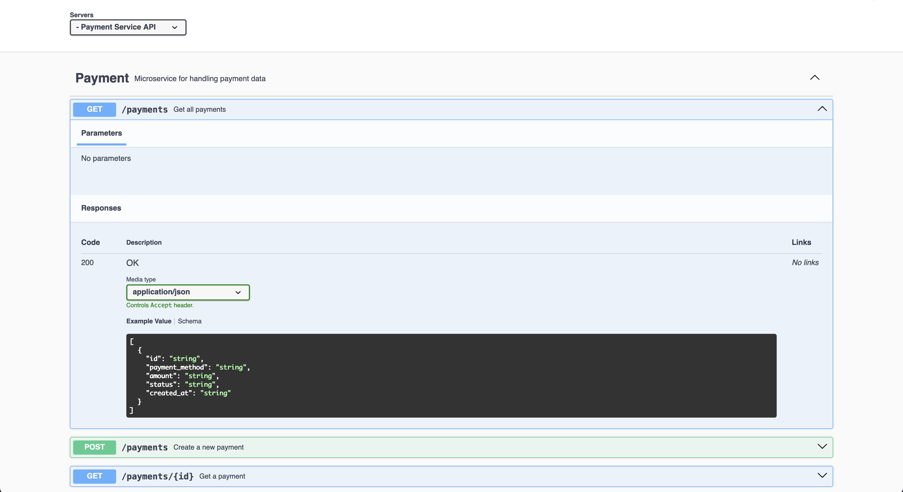
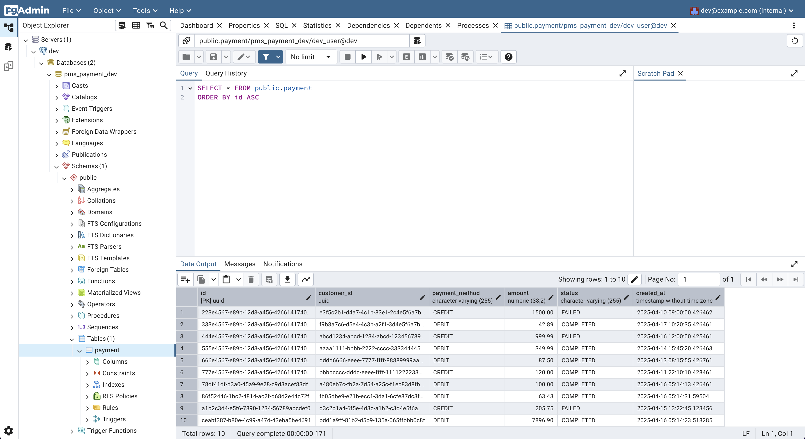

<h1 align="center">
    Payment Management System
</h1>

<br>

<div align="center">
    
    
    
    <br>
    
    <a href="https://jsquared-2.github.io/payment-management-system/index.html" target="_blank"></a>
</div>

## Introduction

This project focuses on creating a scalable monorepo for building Java Spring Boot microservices. The project features
two modules–a shared library and a REST microservice. The project leverages Gradle's support for multi-project builds to
create independent microservices with access to a common library to reduce code duplication.

## Table of Contents

1. [Getting Started](#getting-started)
    1. [Downloading the Repository](#downloading-the-repository)
    2. [Setting Up the Environment](#setting-up-the-environment)
2. [Interacting with the API](#interacting-with-the-api)
    1. [Accessing the Documentation](#accessing-the-documentation)
    2. [Viewing the Data via pgAdmin](#viewing-the-data-via-pgadmin)
3. [License](#license)

## Getting Started

### Downloading the Repository

In order to access the contents of the repository locally, you can clone the repository with the following command:

```bash
git clone https://github.com/jsquared-2/payment-management-system.git
```

From there `cd` into the directory:

```bash
cd payment-management-service
```

<div align="right"><a href="#table-of-contents">↑ Back to Top ↑</a></div>

### Setting Up the Environment

> [!IMPORTANT]
> In order to run the code in the repository [Docker](https://www.docker.com/) **MUST** be installed.

The app has a dependency on a database layer. The database used is a containerized instance of Postgres. To spin up the
database, a UI to view the database ([pgAdmin](https://www.pgadmin.org/)), and the service itself, `cd` into the
following directory:

```bash
cd docker/payment-service
```

> [!NOTE]
> The `.yml` file contains a shorthand for an environment or profile name to allow for creating additional compose files
> tied to different environments or Spring profiles.

Once in the directory execute the following docker compose command to spin up the dependent services in a detached state
from the CLI:

```bash
docker compose --file compose.dev.yml up -d
```

When you are done with the containers, use the following command within the same directory to shut down the services and
remove the containers:

```bash
docker-compose --file compose.dev.yml down
```

<div align="right"><a href="#table-of-contents">↑ Back to Top ↑</a></div>

## Interacting with the API

### Accessing the Documentation

> [!NOTE]
> The API currently supports two `GET` requests and one `POST` request.

There are two ways to interact with and learn about the API.

If the project is set up locally, the documentation can be
accessed at [http://localhost:8082/swagger-ui/index.html](http://localhost:8082/swagger-ui/index.html). If this version
of the docs is available, each method has a `Try it out` button that can be used to execute requests against the
`/payments` resource.



If the project is not set up locally, it is possible to access a read-only version of the documentation
at [https://jsquared-2.github.io/payment-management-service/index.html](https://jsquared-2.github.io/payment-management-system/index.html).
This version has the same information and **DOES NOT** support trying out the API.



<div align="right"><a href="#table-of-contents">↑ Back to Top ↑</a></div>

### Viewing the Data via pgAdmin

> [!IMPORTANT]
> The following instructions assume **NO** modification to the `./docker/payment-service/compose.dev.yml` file.

To view the data stored in the database, log into pgAdmin at [http://localhost:8022](http://localhost:8022) with the
username `dev@example.com` and the password `password`.

In the `Dashboard` tab, click on `Add New Server` under the `Quick Links` section. A modal called `Register - Server`
will
appear. In the `General` tab, you can name the server anything. In the `Connection` tab the hostname should be
`database` (which is the internal Docker hostname), the username should be `dev_user` and the password should be
`password`. Click `Save` and the server should be set up, and should appear in the hierarchy of the `Object Explorer`.

> [!NOTE]
> The development database should be automatically seeded with some data from
`./payment-service/src/main/resources/data.sql`.

Within the hierarchy expand until the following object: `Servers` > `<server-name>` > `Databases` > `pms_payment_dev` >
`Schemas` > `public` > `Tables` > `payment`. Right click on `payment` to bring up the context menu. Select
`View/Edit Data` >
`All Rows`. This will create and run a `SELECT * FROM public.payment ORDER BY id ASC` query and display the results.



<div align="right"><a href="#table-of-contents">↑ Back to Top ↑</a></div>

## License

[MIT](LICENSE.md)
